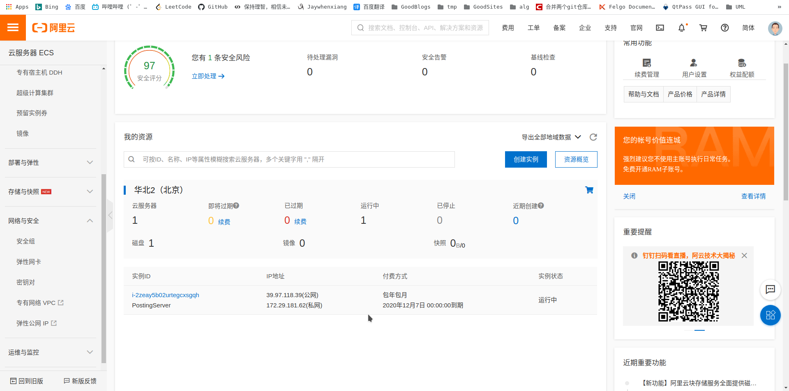

 # 云服务器配置

## 购买阿里云学生机

- [阿里云服务器](https://www.aliyun.com/product/ecs?spm=5176.12825654.eofdhaal5.2.54212c4a0BOGl6)

## 配置安全组规则

- 网络与安全 -> 安全组

- 创建安全组

- 立即设置规则

- 添加安全组规则(UDP)

此时服务器可以接收外网通过 `UDP` 协议发来的数据报

## 安装配置MYSQL

- [bilibili: CentOS 7 中安装mysql](https://www.bilibili.com/video/BV1d54y1R7zw?from=search&seid=13822657675303910644)
- [MYSQL Tutorial](https://dev.mysql.com/doc/refman/8.0/en/tutorial.html)

## 连接云服务器

- [阮一峰：SSH原理与运用（一）：远程登录](http://www.ruanyifeng.com/blog/2011/12/ssh_remote_login.html)
- [阮一峰：SSH原理与运用（二）：远程操作与端口转发](http://www.ruanyifeng.com/blog/2011/12/ssh_port_forwarding.html)

> 通过ssh root@[服务器公网ip] 并输入密码远程连接

