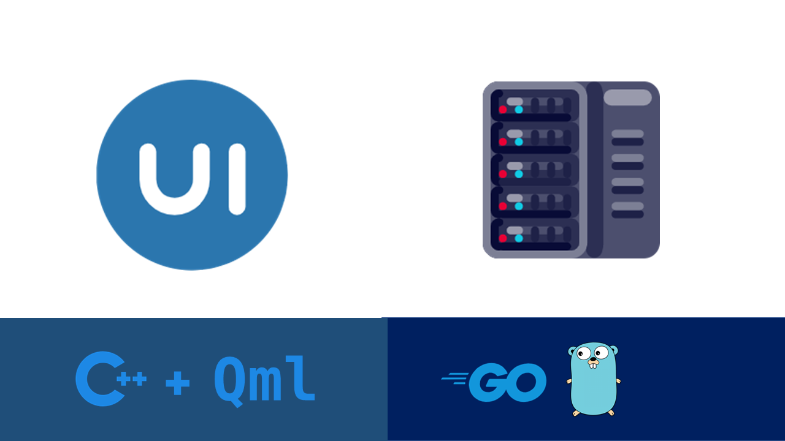
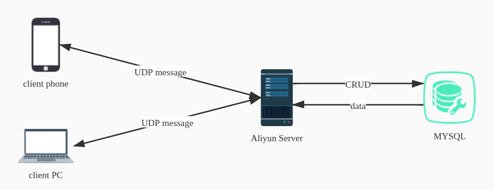

#                             PostinTo 




> PostinTo 是一款客户端使用 Qt + Felgo 开发，服务端使用 Golang 开发的跨多端（`windows`, `linux`, `macos`, `Android`, `ios`）的聊天室应用

```
 ________   ________   ________   _________   ___   ________    _________   ________     
|\   __  \ |\   __  \ |\   ____\ |\___   ___\|\  \ |\   ___  \ |\___   ___\|\   __  \    
\ \  \|\  \\ \  \|\  \\ \  \___|_\|___ \  \_|\ \  \\ \  \\ \  \\|___ \  \_|\ \  \|\  \   
 \ \   ____\\ \  \\\  \\ \_____  \    \ \  \  \ \  \\ \  \\ \  \    \ \  \  \ \  \\\  \  
  \ \  \___| \ \  \\\  \\|____|\  \    \ \  \  \ \  \\ \  \\ \  \    \ \  \  \ \  \\\  \ 
   \ \__\     \ \_______\ ____\_\  \    \ \__\  \ \__\\ \__\\ \__\    \ \__\  \ \_______\
    \|__|      \|_______||\_________\    \|__|   \|__| \|__| \|__|     \|__|   \|_______|
                         \|_________|                                                    
```


## 简述



​																																*`交互逻辑图`*


### 服务端部分

> 服务端程序采用 `Go` 编写，将其部署在云服务器(`CentOS`)上，使用 `Screen` 来实现后台运行.
>
> 提供的服务：
>
> - 响应用户的登录、注册、创建房间、发送聊天消息等操作（数据库的CRUD、资源互斥访问）
> - 发送/接收/处理UDP报文


### UI部分

> UI部分主要采用`Qml`编写，使用了 `Felgo` 框架来对移动端做进一步的支持，小部分的 `C++` 实现报文发送以及处理逻辑


## 进一步了解

- [项目详细说明]()
- [代码规范]()
- [服务端相关配置]()
- [参考与致谢]()


